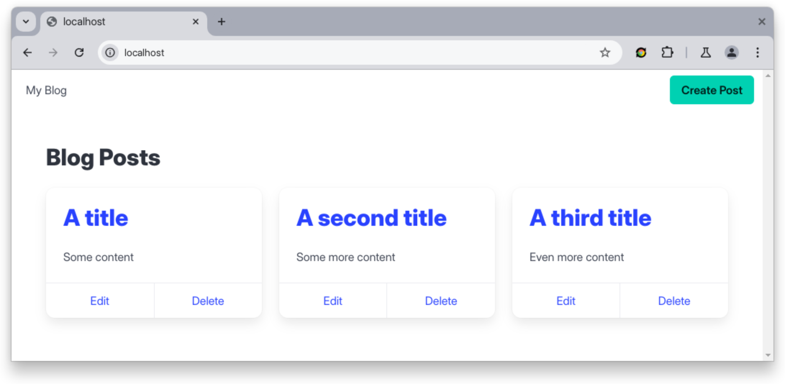

# Blog App

A Blogging App built with Go and PostgreSQL. See the
[final branch](https://github.com/betterstack-community/go-blog/tree/final) for
the updated code with Docker configuration.

**Tutorial**:
[Dockerizing Go Applications: A Step-by-Step Guide](https://betterstack.com/community/guides/scaling-go/dockerize-golang/)

## 🟢 Prerequisites

- Prior Go development experience.
- Familiarity with the Linux command-line.
- Access to a Linux machine with
  [Docker Engine](https://docs.docker.com/engine/install/) installed.

## Getting started

Find the set up instructions in
[step 1 of the article](https://betterstack.com/community/guides/scaling-go/dockerize-golang/#step-1-setting-up-the-demo-project).
